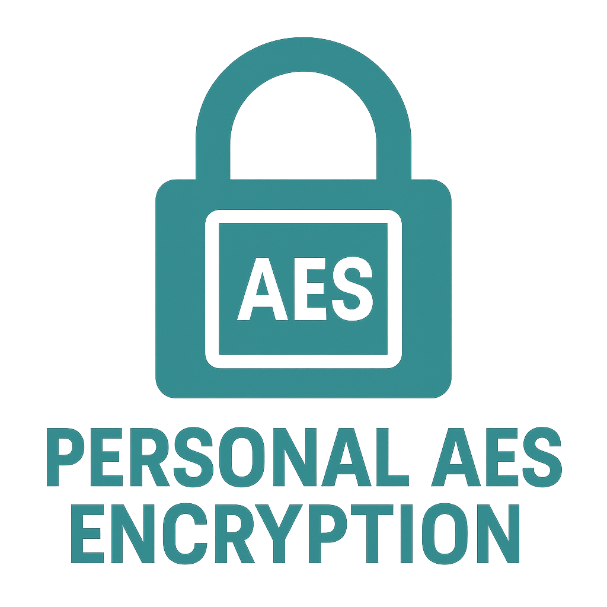

<h1 align="center">Personal Standalone AES File Encryptor</h1>

<p align="center">
  
</p>

<p align="center">
  <a href="https://en.wikipedia.org/wiki/C_(programming_language)">
    
  </a>
  <a href="https://www.openssl.org/">
    
  </a>
  <a href="https://opensource.org/licenses/MIT">
    
  </a>
</p>

---

## ✨ Overview

This project is a **standalone AES-256-CBC encryption and decryption tool** written in C, using OpenSSL's cryptographic libraries. It enables you to **securely encrypt and decrypt files** using a password, with optional salt support and customizable password strength.

---

## 🔒 Key Features

- 🔑 AES-256-CBC symmetric encryption and decryption
- 🔐 Password-based key and IV derivation with `EVP_BytesToKey`
- 🧂 Optional salt or no-salt modes (`-salt` or `-nosalt`)
- 🛠️ Print Key, IV, and Salt information for debugging (`-p`)
- ⚡ Lightweight, simple, and fast C program
- 🖥️ No external dependencies other than OpenSSL libraries

---

## 🛡️ Password Strength Adjustment

You can **adjust the password strength** (i.e., increase the derivation iterations) by modifying a single parameter inside the `derive_key_iv` function.

In `my_aes.c`, around **line 165**, you will find:

```c
int key_iv_len = EVP_BytesToKey(
    cipher,
    dgst,
    salt,
    (const unsigned char *)password,
    strlen(password),
    1,      // Iteration Count of digest, set as 1 for simple security
    key,
    iv
);
```

🔧 To make the key derivation **stronger**, simply increase the `1` (e.g., to `1000` or `10000`).  
Higher iteration counts **slow down brute-force attacks** but may slightly increase encryption time.

---

## 📚 Sources Used

This project was built with the help of:

- [OpenSSL Wiki – EVP Symmetric Encryption and Decryption](https://wiki.openssl.org/index.php/EVP_Symmetric_Encryption_and_Decryption)
- [OpenSSL Documentation](https://www.openssl.org/docs/)
- Community knowledge from **StackOverflow** discussions and code examples.

---

## ⚙️ How To Use

### 1. Environment Setup

- Install **WSL** (Ubuntu 24.04+) on Windows  
**OR**  
- Use **any Linux system** with `gcc` and OpenSSL installed  
**OR**  
- Use a C development environment that supports OpenSSL libraries.

---

### 2. Download the Code

Save `my_aes.c` into a folder.  
If using WSL/Linux, place it somewhere like `~/Documents/Encryption/`.

---

### 3. Compile the Program

Open Terminal, navigate to your folder, and run:

```bash
cd ~/path-to-your-folder
gcc -o my_aes my_aes.c -lcrypto
```

✅ If successful, it will generate an executable called `my_aes`.

---

### 4. Encrypt a File

```bash
./my_aes -e -k <password> -in <input_file_with_extension> -out <output_file_with_extension> -salt  -p
```

- `-e` = encrypt
- `-k` = password for encryption
- `-in` = name of file to encrypt
- `-out` = output encrypted file name
- `-salt` = (or `-nosalt`) adds a salt for extra security
- `-p` = (optional) prints the Key, IV, and Salt

**Example**:

```bash
./my_aes -e -k mySecretPassword -in message.txt -out encrypted_message.txt -salt -p
```

---

### 5. Decrypt a File

```bash
./my_aes -d -k <password> -in <encrypted_file_with_extension> -out <output_file_with_extension> -salt  -p
```

- `-d` = decrypt

**Example**:

```bash
./my_aes -d -k mySecretPassword -in encrypted_message.txt -out decrypted_message.txt -salt -p
```

---

## ⚠️ Security Warnings and Best Practices

### 🔑 **KEEP YOUR PASSWORD/KEY SAFE**

- ***KEY POINT: YOUR PASSWORD IS EVERYTHING.***
- If anyone obtains your password, **they can decrypt your files instantly**.
- There is **no "recovery"** — if you lose the password, the data is unrecoverable.
- Treat your password like you would treat a **bank vault key**.

> ***KEEP THE KEY VERY SAFE! WITHOUT IT, FILES CANNOT BE RECOVERED.***

---

### 🧹 **Clear Your Command Line History After Use (Optional, but Recommended)**

**Warning**:  
Command-line tools like WSL, Ubuntu, and Linux **automatically store** every command you run, including any passwords you might have accidentally entered (like when typing a full command with `-k <password>`).

You can view your history by typing:

```bash
history
```

If you want to **clear your command history** (after encrypting/decrypting files) to protect your password, you can run:

```bash
history -c
```

**⚠️ Be Aware:**

- Clearing history will **remove all previously run commands**, not just encryption-related ones.
- Only do this if you understand that you will lose all command history permanently.

---

# 🚨 REMEMBER
>
> Never share your password in plaintext. Never leave passwords or encryption commands in history files. Always treat your encryption keys with maximum caution.

## ⚠️ Additional Notes

- **Files encrypted with this tool must also be decrypted with this tool.**  
- **This tool is NOT interoperable with the OpenSSL CLI** (`openssl aes-256-cbc`) for decryption or encryption.
- Make sure you have OpenSSL libraries installed (`libssl-dev` on Ubuntu).

---

## 📜 License

This project is licensed under the [MIT License](https://opensource.org/licenses/MIT).
